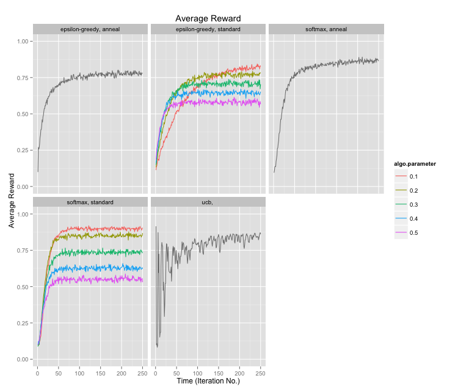
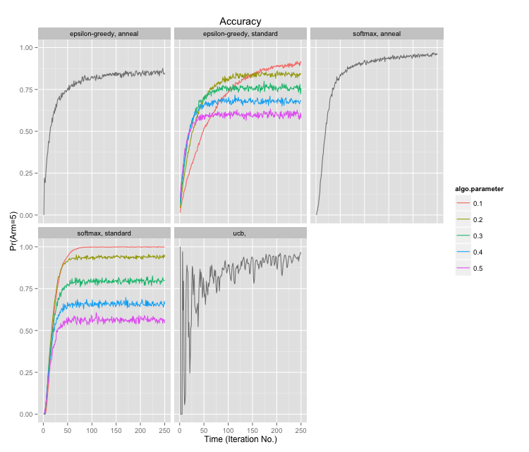
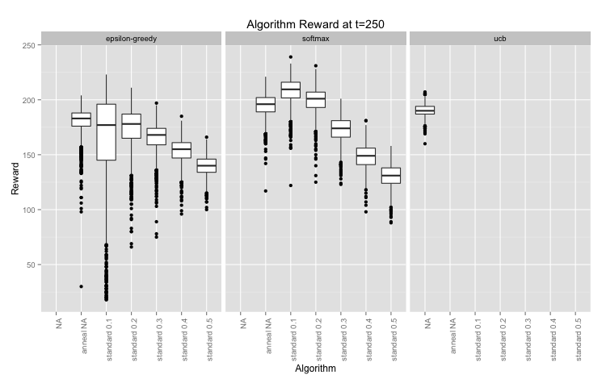

# bandit

A simple Clojure library for multi-armed bandit optimisation.

Algorithms are implemented following ["Bandit Algorithms for Website Optimization"](http://shop.oreilly.com/product/0636920027393.do) by John Myles White.

This library aims to be simple; it concerns itself with multi-armed bandit optimisation only. Integrating with web applications etc. is the responsibility of other libraries.

By keeping it small and simple we hope to make it far easier to integrate than existing tools.

[](http://travis-ci.org/pingles/bandit)

## Dependency

The library is hosted on [Clojars](http://clojars.org) so you can add the following to your `project.clj`:

```clojure
:dependencies [[bandit/bandit-core "0.2.1-SNAPSHOT"]]
```

## Usage

```clojure
(ns casino.wynn
  (:require [bandit.arms :as a]
            [bandit.algo.epsilon :as e]))

;; arms represents the knowledge the algorithm acquires. 
;; a sorted map of bandit.Arm records
(def bandit (a/bandit :arm1 :arm2 :arm3 :arm4 :arm5))

;; casino.wynn> (pprint bandit)
;; {:arm1 {:name :arm1, :pulls 0, :value 0},
;;  :arm2 {:name :arm2, :pulls 0, :value 0},
;;  :arm3 {:name :arm3, :pulls 0, :value 0},
;;  :arm4 {:name :arm4, :pulls 0, :value 0},
;;  :arm5 {:name :arm5, :pulls 0, :value 0}}

(def epsilon 0.1)

(def algo-select (partial e/select-arm epsilon))

;; which arm should we pull?
(def arm (algo-select (vals bandit)))

;; it told us to pull :arm5
;; casino.wynn> arm
;; #clj_bandit.arms.Arm{:name :arm5, :pulls 0, :value 0}

;; let's update the arms to record our payout from :arm5
;; this becomes the next arms state we pass in to e/select-arm
;; we can use 1.0 to indicate we were paid, and 0 to indicate
;; we weren't

(def bandit (a/update (-> arm (a/reward 1) (a/pulled)) bandit))
;; casino.wynn> (pprint bandit)
;; {:arm1 {:name :arm1, :pulls 0, :value 0},
;;  :arm2 {:name :arm2, :pulls 0, :value 0},
;;  :arm3 {:name :arm3, :pulls 0, :value 0},
;;  :arm4 {:name :arm4, :pulls 0, :value 0},
;;  :arm5 {:name :arm5, :pulls 1, :value 1}}
```

## Algorithms

As per the book, the following algorithms have been implemented so far:

* Epsilon-Greedy
* Softmax
* UCB

Implemented but not included in the book:

* Bayesian

## Next up...

### Contextual Bandits

Contextual bandits use feature vectors for both the arm and player to provide context for their performance. There are plenty of references:

1. https://explochallenge.inria.fr/wp-content/uploads/2012/05/paper3.pdf
2. http://hunch.net/?p=298
3. http://www.researchgate.net/publication/235683567_A_Contextual_Bandit_Algorithm_for_Mobile_Context-Aware_Recommender_System/file/79e41513cc887dd2c9.pdf
4. http://courses.cs.washington.edu/courses/cse599s/12sp/scribes/lecture13.pdf
5. http://www.research.rutgers.edu/~lihong/pub/Li10Contextual.pdf

But 1 looks to be the most accessible, showing a couple of variations for adding context to arms.

### Incanter Charts

* Update the simulation project to enable real-time graphs to be plotted showing cumulative reward/regret as the simulation executes?

## Performance

["Bandit Algorithms for Website Optimization"](http://shop.oreilly.com/product/0636920027393.do) uses Monte Carlo Simulation to measure the performance of the algorithms. These can be run using functions from `bandit.simulate`, and `./scripts/plot_results.r` will produce the following plots with ggplot2.

In the plots below, `algo.variant` can refer to either a "standard" or "annealing" algorithm (annealing applies a factor that causes the algorithm to explore less as it gains more experience). For "standard" algorithms, `algo.parameter` represents the temperature or epsilon value used to tune the algorithms tendency to explore.

* Epsilon-Greedy: the variant is the epsilon value (0.1, 0.2 etc.); 0.1 would mean the algorithm would experiment 10% of the time, and exploit the best performing for the remainder.
* softmax: the variant is the algorithm's temperature, behaving much like the epsilon value above.
* ucb: no variant value is used.

Results are for a 5-armed machine, rewarding at rates of: 10%, 10%, 10%, 10%, 90%. This is the same example as used in the book. Such significantly varying payouts are unlikely for most other applications so I'll update with some more complex simulations later.

### Average Reward



### Accuracy



### Cumulative Reward


The following plot shows the summary for the algorithms when the simulation finished. 1500 simulations were run.



## License

Copyright &copy; Paul Ingles 2012

Distributed under the Eclipse Public License, the same as Clojure.
